# Duolingo Data Warehouse Implementation Plan

I would like to say in advance that I don't have a ready-made solution and visual presentation of results, however I would like to outline my execution plan.

## Approach Selection

When approaching the task of building a data warehouse for Duolingo company for analysts, we can take two paths:

1) **Bottom-up**: from analyzing all business entities, the business as a whole, and building corresponding data models to implementing data marts
2) **Top-down**: from defining a list of metrics to modeling business entities

Within the framework of this task, given the tight timeframes, the second option is more suitable.

However, without thinking through business processes, we won't be able to generate truly realistic test data.

## Business Logic Philosophy

I believe that business logic: score calculation, group creation, league creation, etc., happens on the backend and is an operational matter. We should receive already calculated data in the analytical warehouse. So I simulate operational calculations only for adequate test data generation.

## Key Business Process

The key business process for us is **moving users between groups**, determining the composition of these groups, etc.

I proceed from the following:
- User league changes happen **once a week** based on their performance results for the last week
- Users compete in a group with other users of the same league. The maximum size of such a group is **fixed and equals 30**
- The only criterion determining whether a user remains in this group after a week is their **position on the leaderboard** in their group
- **5 are promoted** to the league above, **10 to the league below**, the rest remain in the current group
- Every week **new users register** in the application, new groups are created according to the number of new users

## Architecture Understanding

A little bit of attention needs to be paid to arrive at a common understanding of the warehouse architecture and data flows.

I proceed from the fact that:
- Data on user interaction with the application comes to ClickHouse in the form of **clickstream** (event records). The application transmits event details in `json_payload`
- Due to the necessity of maintaining **data consistency and their sensitivity** (GDPR), all data except clickstream from the application comes to ClickHouse **from PostgreSQL**
- Given that data comes from PostgreSQL via **CDC**, we will create separately **staging table** (for CDC) and **SCD2 table** for storing history and analytical queries
- In order to extract insights needed by analysts from the clickstream, there will be a **separate clickstream parsing process**

## Entity Analysis

The list of entities after business analysis looks as follows:

### **Anticipated Reference Tables:**
- Users
- League types (gold, silver, etc.)
- League groups (those where users are placed)
- Lessons
- Event types
- Calendar

### **Anticipated Fact Tables:**
- Application clickstream events
- User league group assignments
- User activity based on clickstream parsing results

For each entity except clickstream, we create **two tables** (one staging for CDC processing, another SCD2 for storing validity periods of entity parameters and analytics).

## Data Generation Cycle

Over **4 weeks**, new users come to us, and existing ones take lessons and move between groups. This means we will perform **generation in a cycle**.

### Generation Order

The generation order based on dependencies between entities is as follows:
- **Leagues** - Once
- **Event types** - Once
- **Lessons** - Once
- **Users** - Initial and weekly
- **League groups** - Weekly
- **User league assignments** - Weekly

## Detailed Implementation Process

If we go into a bit more detail, the generation and population order is as follows:

1. **Generate dataframe** of main reference tables (league types, lessons, event types, calendar) and **load to staging**
2. **Run SQL script** to populate corresponding SCD2 tables based on staging data
3. **Generate dataframe** for league groups (based on number of new users)
4. **Assign users to league groups** (while updating `actual_participants` attribute) based on previous results
5. **Generate clickstream** only for users who are assigned to league groups
6. **Parse clickstream** and extract lesson completion information, **populate user_activity table**
7. **Close validity periods** for groups (with setting `actual_participants` for the previous period)
8. **Close validity periods** for user group assignments (with setting `final_rank`, `total_xp_earned`, `outcome` based on their weekly activity)

## Architecture Diagram

### **Diagram Legend:**
- **Staging Tables**: CDC operations (op, cdc_timestamp, processed)
- **SCD2 Tables**: Historicity (valid_from/valid_to, is_current, version)
- **Fact Tables**: Business events (append-only or SCD2)
- **Calendar Dimension**: Time periods

## Implementation Flow Diagram

```mermaid
graph TD
    %% Initialization (one-time)
    A[📅 dim_weeks] --> B[🏆 ligue_tiers_staging]
    B --> C[🏆 ligue_tiers SCD2]
    C --> D[⚡ event_types_staging]
    D --> E[⚡ event_types SCD2]
    E --> F[📚 lessons_staging]
    F --> G[📚 lessons SCD2]

    %% Weekly cycle - beginning of week
    G --> H[👥 users_staging]
    H --> I[👥 users SCD2]
    I --> J[🏟️ ligue_instances_staging]
    J --> K[🏟️ ligue_instances SCD2]
    K --> L[📋 ligue_assignment_staging INSERT]
    L --> M[📋 ligue_assignment SCD2]

    %% Event generation and activity
    M --> N[🎯 event_stream generation]
    N --> O[📊 user_activity parsing]

    %% End of week - UPDATE operations
    O --> P[🔄 ligue_instances UPDATE]
    P --> Q[📋 ligue_assignment_staging UPDATE]
    Q --> R[📋 ligue_assignment SCD2 finalization]

    %% Loop to next week
    R --> S{More weeks?}
    S -->|Yes| H
    S -->|No| T[✅ Complete]

    %% Styles
    classDef staging fill:#ffeaa7,stroke:#fdcb6e,stroke-width:2px
    classDef scd2 fill:#81ecec,stroke:#00cec9,stroke-width:2px
    classDef process fill:#fd79a8,stroke:#e84393,stroke-width:2px
    classDef decision fill:#a29bfe,stroke:#6c5ce7,stroke-width:2px

    class B,D,F,H,J,L,Q staging
    class C,E,G,I,K,M,R scd2
    class N,O,P process
    class S decision
```

### **Flow Legend:**
- **🟡 Staging**: CDC data loading to staging tables
- **🔵 SCD2**: Historical data processing with versioning
- **🔴 Process**: Business logic execution (events, parsing, updates)
- **🟣 Decision**: Flow control for weekly cycles
